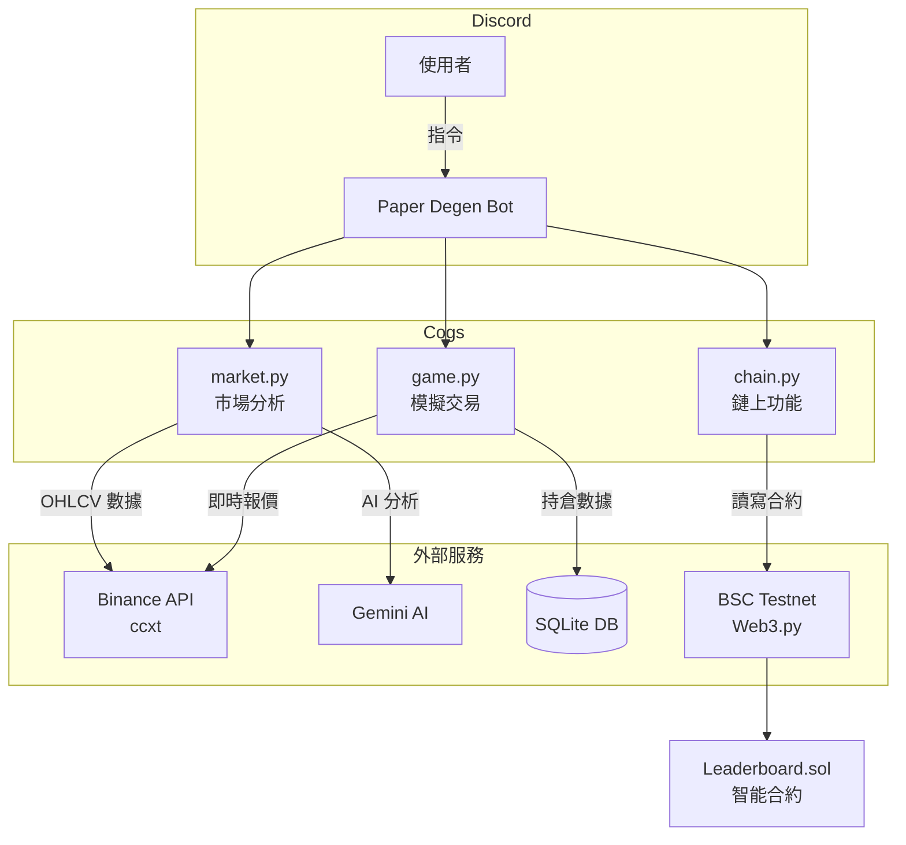

# 🎯 Paper Degen — AI 模擬交易達人

*[Read this in English](README_EN.md)*

<div align="center">

**BNB Chain 上的 AI 交易助手 Discord Bot**

讓不懂加密貨幣的人也能輕鬆體驗交易的樂趣 🚀

[](https://www.bnbchain.org/)
[](https://python.org)
[](https://discord.com)
[](https://ai.google.dev/)

</div>

---

## 📖 專案簡介

**Paper Degen（模擬交易達人）** 是一個為 **BNB Hack: Online Edition (AI Track)** 打造的 Discord Bot，旨在降低加密貨幣交易的門檻。透過 AI 驅動的市場分析和模擬交易遊戲，讓任何人都能零風險地體驗交易世界。

## 🎥 Hackathon 提交資料 (BNB Hack: Online Edition)
- **Pitch Deck**: `Paper_Degen presentation deck.pdf` (隨大會表單附上)
- **Challenge Tweet**: [View on X (Twitter)](https://x.com/coding_mouse_/status/2026318277149077890)
- **Demo Video**: [YouTube Link](https://youtu.be/YKEVcFerK7M) <!-- 請於此替換為您的 YouTube 實際連結 -->

### 🌟 核心特色

| 功能 | 說明 |
|---|---|
| 🤖 **AI 市場分析** | Gemini AI 扮演毒舌華爾街交易員，用繁體中文給出犀利評論（具備 Rate Limit 自動重試機制） |
| 🎮 **模擬交易遊戲** | 每人 10,000 USDT 虛擬資金，以即時價格買賣 |
| ⛓️ **鏈上排行榜** | ROI 成績上鏈到 **opBNB Testnet** (Layer 2)，速度快且 Gas 低 |
| 📊 **即時報價** | 串接 Binance API，取得最新市場數據 |

---

## 🏗️ 系統架構



---

## 🚀 快速開始

### 前置需求
- Python 3.10+
- [Discord Bot Token](https://discord.com/developers/applications)
- [Gemini API Key](https://aistudio.google.com/app/apikey)
- (可選) BSC Testnet 錢包 & [tBNB](https://www.bnbchain.org/en/testnet-faucet)

### 安裝步驟

```bash
# 1. Clone 專案
git clone https://github.com/LanLan0427/Paper_Degen.git
cd Paper_Degen

# 2. 建立虛擬環境
python -m venv .venv
.\.venv\Scripts\activate  # Windows
# source .venv/bin/activate  # macOS/Linux

# 3. 安裝相依套件
pip install -r requirements.txt

# 4. 設定環境變數
cp .env.example .env
# 編輯 .env 填入你的 API Keys

# 5. 啟動 Bot
python main.py
```

---

## 📋 指令一覽

| 指令 | 別名 | 說明 |
|---|---|---|
| `!analyze [symbol]` | `!a`, `!分析` | AI 分析市場走勢（預設 BNB/USDT） |
| `!buy [symbol] [金額]` | `!買` | 買入代幣（花費 USDT） |
| `!sell [symbol] [數量]` | `!賣` | 賣出代幣 |
| `!portfolio` | `!p`, `!持倉` | 查看投資組合與 ROI |
| `!submit` | `!提交` | 將 ROI 提交到鏈上排行榜 |
| `!leaderboard` | `!lb`, `!排行榜` | 查看鏈上排行榜 |

---

## 📁 專案結構

```
paper-degen/
├── main.py                     # Bot 入口
├── cogs/
├── market.py               # AI 市場分析（ccxt + Gemini）
├── game.py                 # 模擬交易（SQLite）
└── chain.py                # 鏈上排行榜（Web3.py）
├── contracts/
└── Leaderboard.sol         # 排行榜智能合約
├── data/                       # SQLite 資料庫（自動建立）
├── requirements.txt
├── .env.example
├── WALKTHROUGH.md              # 開發與修復紀錄
└── README.md
```

---

## ⛓️ 智能合約

**Leaderboard.sol** 部署於 **opBNB Testnet**：

- **合約地址**：`0x52708366F7A11c166Bb94d398951719F032CB945`
- **BscScan**：[查看合約](https://testnet.bscscan.com/address/0x52708366F7A11c166Bb94d398951719F032CB945)
- **功能**：儲存玩家 ROI 分數、查詢排名

---

## 🛠️ 技術棧

| 技術 | 用途 |
|---|---|
| `discord.py` | Discord Bot 框架 |
| `ccxt` | Binance 市場數據 API |
| `google-generativeai` | Gemini AI 市場分析 |
| `web3.py` | BNB Chain 智能合約互動 |
| `solcx` / `web3.py` | 智能合約互動與部署 |
| `sqlite3` | 本地模擬交易資料儲存 |
| `Solidity` | 鏈上排行榜智能合約 |
| `tenacity` | API 重試機制 (Rate Limit Handling) |

---

## 🗺️ Roadmap (未來藍圖)

為了在黑客松之後繼續發展，**Paper Degen** 規畫了以下發展路線：

- **Phase 1: 完善 AI 顧問功能 (Q2 2026)**
  - 引入更多技術指標 (RSI, MACD 等) 供 AI 分析。
  - 支援更多 BNB Chain 上的 DeFi 協議。
- **Phase 2: 真實資金交易整合 (Q3 2026)**
  - 當使用者準備好時，提供從「模擬交易」切換至「真實交易」的選項（透過 Web3 錢包簽名，整合 opBNB DEX，如 PancakeSwap）。
  - AI 提供即時的執行價格滑點 (Slippage) 警告。
- **Phase 3: 社交金融與 DAO (Q4 2026)**
  - 推出 Copy Trading (跟單) 功能，讓新手能自動跟隨排行榜高手的操作。
  - 成立 Degen DAO，由社群治理 AI 模型的升級方向與合約參數。

---

## 💼 Business Model (商業模式)

為了確保專案的長期維運與可持續發展，我們設計了以下收益模式：

1. **進階 AI 分析訂閱 (Premium Subscription)**
   - 基礎使用者享有每日一定次數的免費 AI 分析。
   - 訂閱制用戶可解鎖「無限制 AI 額度」、「深度市場報告」以及「專屬交易策略推薦」。
2. **交易手續費分潤 (Transaction Fee Sharing)**
   - 在未來整合真實 DEX 交易後 (Phase 2)，推薦使用者前往合作的 DEX（例如 BNB Chain 上的 DEX）進行交易，並從中獲取推薦手續費或微量滑點收益。
3. **Copy Trading 分潤機制**
   - 平台從跟單獲利中抽取小比例手續費，並分潤給提供策略的「排行榜達人」，激勵更多優秀交易員加入。

---

## 📄 License

MIT License — 詳見 [LICENSE](LICENSE) 文件

---

<div align="center">

**Built with ❤️ for BNB Hack: Online Edition**

</div>
