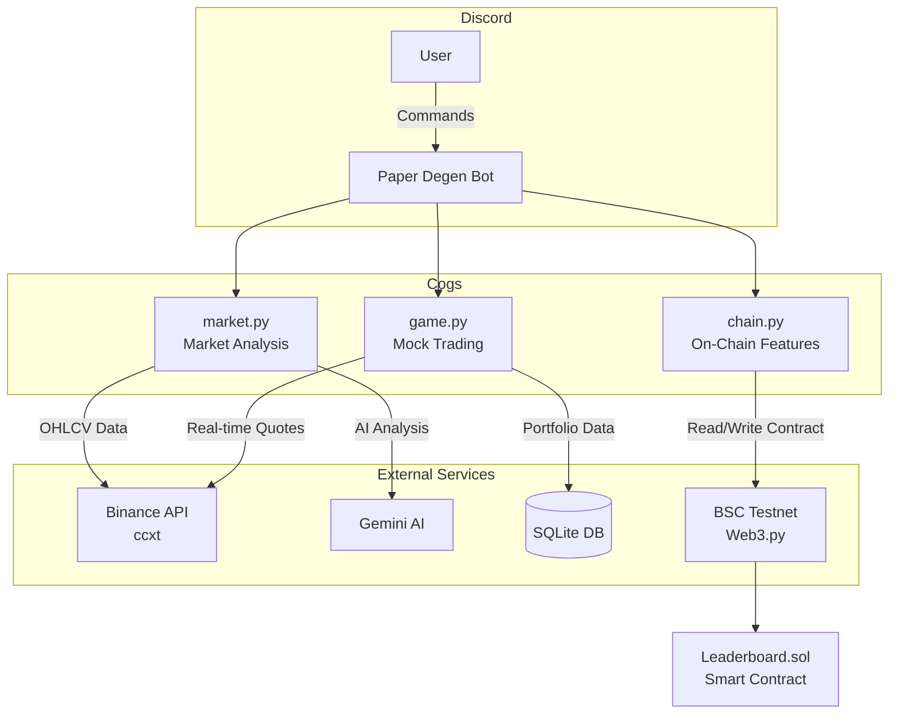

# 🎯 Paper Degen — AI Mock Trading Master

*[Read checking in Traditional Chinese](README.md)*

<div align="center">

**An AI Trading Assistant Discord Bot on BNB Chain**

Allowing anyone, even crypto beginners, to easily experience the thrill of trading 🚀

[](https://www.bnbchain.org/)
[](https://python.org)
[](https://discord.com)
[](https://ai.google.dev/)

</div>

---

## 📖 Introduction

**Paper Degen** is a Discord Bot built for the **BNB Hack: Online Edition (AI Track)**, designed to lower the barrier to entry for cryptocurrency trading. Driven by AI market analysis and a mock trading game, it allows anyone to experience the trading world with zero risk.

## 🎥 Demo Video & Pitch Deck (Hackathon Submission)
- **Pitch Deck**: [Placeholder] (Coming Soon)
- **Demo Video**: [Placeholder] (Coming Soon)

### 🌟 Core Features

| Feature | Description |
|---|---|
| 🤖 **AI Market Analysis** | Gemini AI plays the role of a sarcastic Wall Street trader, providing sharp market commentary in Traditional Chinese (with an automatic Rate Limit retry mechanism). |
| 🎮 **Mock Trading Game** | Each player gets 10,000 USDT in virtual funds to buy and sell at real-time prices. |
| ⛓️ **On-Chain Leaderboard** | ROI scores are recorded on the **opBNB Testnet** (Layer 2) for fast speed and low Gas fees. |
| 📊 **Real-time Quotes** | Integrates with the Binance API to fetch the latest market data. |

---

## 🏗️ System Architecture



---

## 🚀 Quick Start

### Prerequisites
- Python 3.10+
- [Discord Bot Token](https://discord.com/developers/applications)
- [Gemini API Key](https://aistudio.google.com/app/apikey)
- (Optional) BSC Testnet Wallet & [tBNB](https://www.bnbchain.org/en/testnet-faucet)

### Installation Steps

```bash
# 1. Clone the repository
git clone https://github.com/LanLan0427/BNB_Hack.git
cd BNB_Hack

# 2. Create a virtual environment
python -m venv .venv
.\.venv\Scripts\activate  # Windows
# source .venv/bin/activate  # macOS/Linux

# 3. Install dependencies
pip install -r requirements.txt

# 4. Set environment variables
cp .env.example .env
# Edit .env and fill in your API Keys

# 5. Start the Bot
python main.py
```

---

## 📋 Commands Overview

| Command | Aliases | Description |
|---|---|---|
| `!analyze [symbol]` | `!a`, `!分析` | AI analyzes market trends (default: BNB/USDT) |
| `!buy [symbol] [amount]` | `!買` | Buy tokens (spending virtual USDT) |
| `!sell [symbol] [amount]` | `!賣` | Sell tokens |
| `!portfolio` | `!p`, `!持倉` | View portfolio and ROI |
| `!submit` | `!提交` | Submit ROI to the on-chain leaderboard |
| `!leaderboard` | `!lb`, `!排行榜` | View the on-chain leaderboard |

---

## 📁 Project Structure

```
paper-degen/
├── main.py                     # Bot entry point
├── cogs/
│   ├── market.py               # AI Market Analysis (ccxt + Gemini)
│   ├── game.py                 # Mock Trading (SQLite)
│   └── chain.py                # On-Chain Leaderboard (Web3.py)
├── contracts/
│   └── Leaderboard.sol         # Leaderboard Smart Contract
├── data/                       # SQLite Database (Auto-created)
├── requirements.txt
├── .env.example
├── WALKTHROUGH.md              # Development & Fix Log
├── README_EN.md
└── README.md
```

---

## ⛓️ Smart Contract

**Leaderboard.sol** is deployed on the **opBNB Testnet**:

- **Contract Address**: `0x52708366F7A11c166Bb94d398951719F032CB945`
- **BscScan**: [View Contract](https://testnet.opbnbscan.com/address/0x52708366F7A11c166Bb94d398951719F032CB945)
- **Features**: Store player ROI scores, query rankings

---

## 🛠️ Tech Stack

| Technology | Purpose |
|---|---|
| `discord.py` | Discord Bot Framework |
| `ccxt` | Binance Market Data API |
| `google-generativeai` | Gemini AI Market Analysis |
| `web3.py` | BNB Chain Smart Contract Interaction |
| `solcx` / `web3.py` | Smart Contract Compilation & Deployment |
| `sqlite3` | Local Mock Trading Data Storage |
| `Solidity` | On-Chain Leaderboard Smart Contract |
| `tenacity` | API Retry Mechanism (Rate Limit Handling) |

---

## 🗺️ Roadmap

To continue development after the hackathon, **Paper Degen** has planned the following roadmap:

- **Phase 1: Enhance AI Advisor Features (Q3 2024)**
  - Introduce more technical indicators (RSI, MACD, etc.) for AI analysis.
  - Support more DeFi protocols on the BNB Chain.
- **Phase 2: Real Funds Trading Integration (Q4 2024)**
  - When users are ready, provide an option to switch from "Mock Trading" to "Real Trading" (via Web3 Wallet signatures, integrating opBNB DEXs like PancakeSwap).
  - AI provides real-time execution price slippage warnings.
- **Phase 3: Social Finance & DAO (Q1 2025)**
  - Launch a Copy Trading feature, allowing beginners to automatically follow the operations of top players on the leaderboard.
  - Establish the Degen DAO, governed by the community to decide the AI model upgrade direction and contract parameters.

---

## 💼 Business Model

To ensure the long-term maintenance and sustainable development of the project, we have designed the following revenue models:

1. **Premium AI Analysis Subscription**
   - Basic users enjoy a limited number of free daily AI analyses.
   - Subscribed users can unlock "Unlimited AI Quota", "In-depth Market Reports", and "Exclusive Trading Strategy Recommendations".
2. **Transaction Fee Sharing**
   - After integrating real DEX trading in the future (Phase 2), we will recommend users trade on partner DEXs (e.g., DEXs on BNB Chain) and earn referral fees or micropayment slippage revenue.
3. **Copy Trading Revenue Sharing Mechanism**
   - The platform takes a small percentage fee from copy trading profits and shares it with the "Leaderboard Masters" who provide the strategies, incentivizing more excellent traders to join.

---

## 📄 License

MIT License — See the [LICENSE](LICENSE) file for details.

---

<div align="center">

**Built with ❤️ for BNB Hack: Online Edition**

</div>
